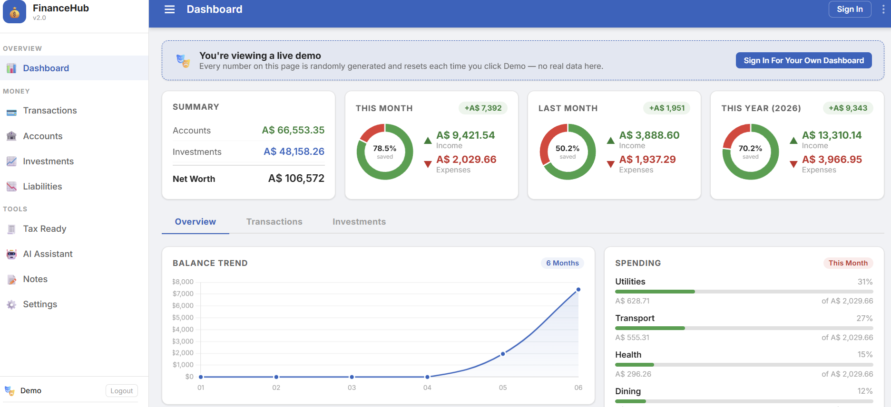
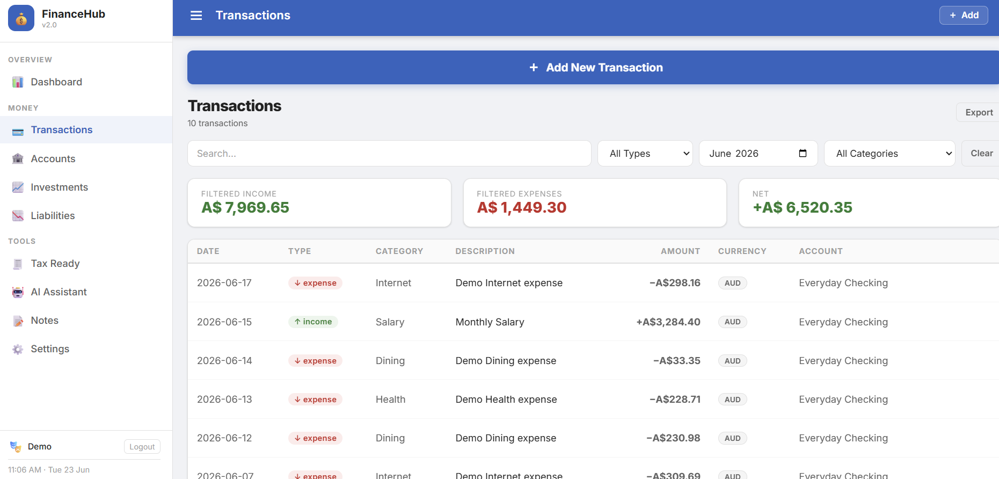
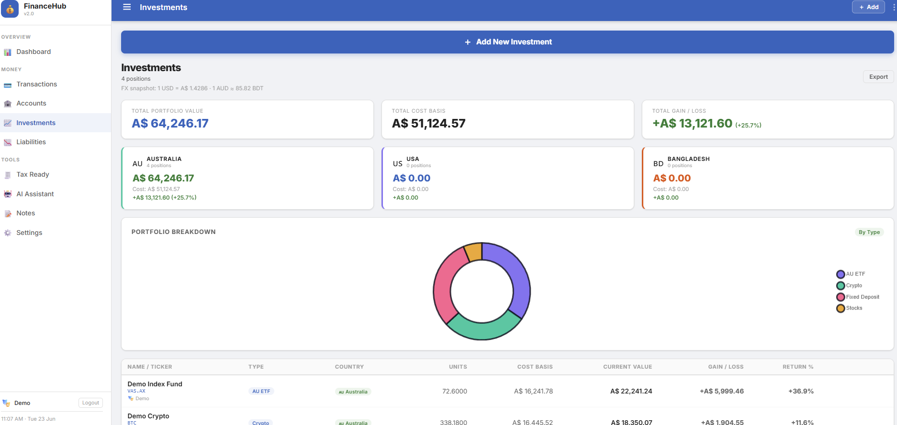
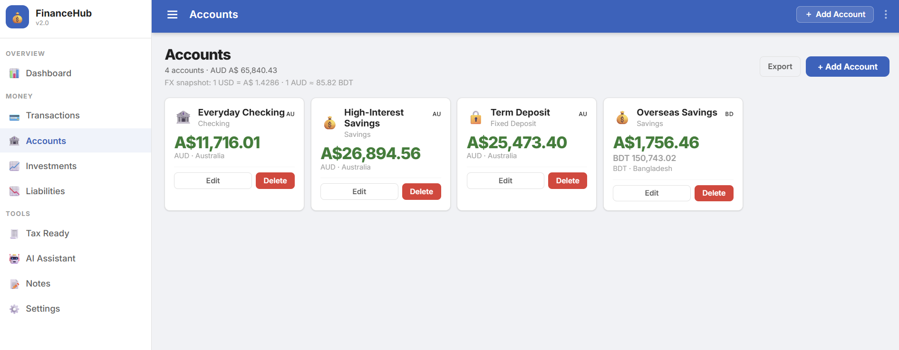

<div align="center">

# 💰 Finance Hub V2.1.0

**Self-hosted personal finance dashboard. Multi-currency. AI-assisted. Locally owned.**

Track transactions · Manage investments · Monitor accounts · Visualise net worth · Run recurring rules · Chat with your finances via AI


**[Features](#-features-in-detail) · [Quick Start](#-quick-start) · [Troubleshooting](#-troubleshooting) · [Security](#-security) · [Updating](#-updating) · [License](#-license)**

</div>

---

## 📸 Screenshots

<table>
  <tr>
    <td align="center" width="50%">
      
      <br/><b>📊 Dashboard</b> — net worth, income/expense donuts, balance trend, spending by category
    </td>
    <td align="center" width="50%">
      
      <br/><b>💸 Transactions</b> — BDT/USD → AUD live conversion, recurring templates, filters
    </td>
  </tr>
  <tr>
    <td align="center" width="50%">
      
      <br/><b>📈 Investments</b> — portfolio by country 🇦🇺 🇺🇸 🇧🇩, gain/loss in AUD, property cash flow
    </td>
    <td align="center" width="50%">
      
      <br/><b>🏦 Accounts</b> — multi-currency balances all converted to AUD in real time
    </td>
  </tr>
</table>

---

## ✨ Why Finance Hub?

- **100% local:** your financial data never leaves your machine.
- **Multi-currency:** live FX rates (AUD, USD, BDT and more) auto-convert every figure to AUD.
- **Recurring transactions:** set weekly, monthly or yearly rules and the system posts them automatically on schedule.
- **Investment tracking:** cost basis vs current value with gain/loss %, grouped by country and type.
- **Property cash flow:** a dedicated Bangladesh property dashboard with BDT → AUD rental income tracking.
- **AI chat:** ask questions about your own finances using any local or cloud LLM.
- **Tax notes:** per-category tax annotation for year-end reporting.
- **Multi-user with role control:** admin creates users with passwords and shares credentials. Non-admin users see only their own data — transactions, accounts, investments, notes, and categories are all fully isolated. Shared household investments remain visible to all members.
- **Secure settings:** non-admin users see only what they need — AI engine config and user management are admin-only.
- **Export:** CSV and Excel export of any dataset.
- **Dark UI:** responsive, mobile-first design that works on phone or desktop.

---

## 📋 Prerequisites

| Requirement   | Minimum                   | Notes                                 |
| -------------- | -------------------------- | --------------------------------------- |
| Python        | 3.10+                      | 3.11 recommended                        |
| OS            | Windows / macOS / Linux    | Any platform Python runs on             |
| Browser       | Chrome / Firefox / Safari  | Modern browser required for charts      |
| Disk          | ~50 MB                     | SQLite database grows with your data    |
| RAM           | 256 MB                     | Lightweight Flask server                |
| AI (optional) | Any OpenAI-compatible API  | Ollama, OpenAI, Anthropic, etc.         |

---

## 🚀 Quick Start

New to this? Follow these steps in order. Each one works the same on Windows, macOS and Linux unless noted.

### 1. Install Python

Skip this if `python --version` already prints 3.10 or higher. Otherwise grab it from [python.org/downloads](https://www.python.org/downloads/) and, on Windows, tick **"Add python.exe to PATH"** during setup.

### 2. Clone the repository

```bash
git clone https://github.com/pavelblank/finance-hub.git
cd finance-hub
```

No Git? Click the green **Code** button on the [GitHub page](https://github.com/pavelblank/finance-hub) and choose **Download ZIP**, then extract it and open a terminal in that folder.

### 3. (Optional but recommended) Create a virtual environment

```bash
python -m venv venv
venv\Scripts\activate        # Windows
source venv/bin/activate     # macOS / Linux
```

### 4. Install dependencies

```bash
pip install -r requirements.txt
```

### 5. Run the server

**Windows:** double-click `run.bat`, or run it from a terminal.

**macOS / Linux:**

```bash
python main.py
```

### 6. Open the app

```
http://localhost:8082
```

No account exists yet on first run. Open the **Settings** page and create your username and password there.

### 7. (Optional) Load demo data

Want to see the dashboard populated before entering real numbers?

```bash
python seed_demo.py
```

This adds randomised sample transactions, investments and accounts. No real financial data is included or required.

### 8. (Optional) Connect an AI provider

Go to **Settings → AI Providers** and add an API key for any supported engine:

| Engine                | Notes                                          |
| ---------------------- | ------------------------------------------------ |
| Ollama (local)         | Free and runs offline. Install from ollama.com   |
| OpenAI (GPT-4o)        | Requires an API key                              |
| Anthropic (Claude)     | Requires an API key                              |
| OpenRouter             | Access 100+ models with one key                  |
| Any OpenAI-compatible  | Custom base URL supported                        |

---

## 🔥 Features in Detail

### 💸 Transactions

- Add income/expense entries with date, category, amount, currency, account and notes.
- **Live FX conversion:** BDT and USD amounts display as their AUD equivalent, with the original shown below.
- **Recurring templates:** weekly, monthly or yearly auto-posting rules.
- Summary strip: filtered income, expenses and net, always shown in AUD.
- Category autocomplete: new categories are created automatically on first use.
- Search and filter by type, month or category.

### 📈 Investments

- Track positions by name, type, units, cost basis, current value, currency and country.
- **AUD conversion:** USD and BDT positions are converted at live rates in every column.
- Country breakdown cards: 🇦🇺 Australia · 🇺🇸 USA · 🇧🇩 Bangladesh.
- Gain/loss % per position and per country.
- **Property cash flow dashboard** (Bangladesh property section):
  - Monthly rental income in BDT plus AUD equivalent.
  - Maintenance and repair cost tracking.
  - Upcoming scheduled costs calendar.
  - All-time cash flow summary.
- Portfolio doughnut chart by investment type.

### 🏦 Accounts

- Multi-currency account balances (AUD, USD, BDT).
- All balances displayed in AUD with the original currency shown alongside.
- Account types: Savings, Checking, Fixed Deposit, Investment.
- Country tagging (Australia, USA, Bangladesh, Other).

### 📊 Dashboard

- **Net worth** = Accounts + Investments - Liabilities, all converted to AUD.
- This Month / Last Month / This Year income vs expense donuts.
- Balance trend line chart (6 months).
- Income vs expenses bar chart (weekly, monthly or yearly).
- Spending by category progress bars.
- Investment portfolio pie chart.
- Investment trend chart (value vs cost basis over time).
- Recent transactions widget with AUD conversion.

### 🔁 Recurring Transactions

- Turn any transaction into a recurring template.
- Frequencies: weekly, monthly, yearly.
- Optional start and end dates.
- Auto-processed every time the Transactions page loads.
- Summary strip shows total recurring income and recurring cost per month.

### 🤖 AI Chat

- Ask natural-language questions about your finances.
- Context-aware: optionally inject your account, investment and transaction summaries.
- Switch AI providers from within the chat UI.
- Chat history is persisted locally.

### 👥 Multi-User & Role Control

- Admin creates household members and sets their password — credentials are shown once to share.
- Each user logs in with their own username and password.
- **Full data isolation:** transactions, accounts, investments, liabilities, notes and categories are scoped per user. Users never see each other's data.
- **Shared investments:** positions marked as "Household" (user_id 0) are visible to all members.
- **Role-based settings:** non-admin users see only Categories, Export, Timezone, Business Profile and My Account. AI engine config and User management are admin-only.
- **Demo account:** a built-in `/demo` entry point lets anyone explore the app with randomised data, fully sandboxed from real household data.
- **Protected accounts:** the Demo account and primary admin cannot be deleted.

### 📝 Tax & Notes

- Per-category tax notes for year-end reporting.
- A free-form notes section for financial memos — private per user.

### 📤 Export

- CSV and Excel (XLSX) export for transactions, investments, accounts and liabilities.
- Accessible from **Settings → Export**.

---

## 🌐 Live FX Rates

Finance Hub fetches live exchange rates from `open.er-api.com` (free, no API key required) and caches them for one hour.

| Pair      | Source                    |
| ---------- | --------------------------- |
| USD → AUD | Live API                    |
| BDT → AUD | Cross-calculated via USD    |

Fallback rates are used automatically if the API is unreachable:

- `1 USD = 1.4275 AUD`
- `1 BDT ≈ 0.01161 AUD`

---

## 🗃️ Template Data

The repository ships with **no personal data**. On first run, Finance Hub creates an empty database.

To explore the app with sample data, run the seed script:

```bash
python seed_demo.py
```

This creates:

- 3 sample users (Admin, Partner, Demo).
- 12 months of randomised income/expense transactions.
- 6 sample investments (Australian ETF, US ETF, Bangladesh property).
- 3 sample accounts (Savings AUD, Fixed Deposit BDT, US Brokerage USD).
- Sample recurring templates (rent, utilities, subscriptions).

All amounts are randomised. No real financial data is included.

> ⚠️ **Before deploying publicly:** change the default admin password in Settings, set a strong `secret.key`, and keep the server bound to `localhost` (the default) unless it sits behind a reverse proxy with HTTPS.

---

## 📁 Project Structure

```
finance-hub/
├── main.py                  # Flask app: routes, API endpoints, FX logic
├── requirements.txt         # Python dependencies
├── run.bat                  # Windows launcher
├── seed_demo.py              # Demo data seeder (no real data)
├── README.md
├── LICENSE
├── templates/
│   ├── base.html            # Shared layout, nav, styles
│   ├── index.html           # Dashboard
│   ├── transactions.html    # Transaction list + recurring
│   ├── investments.html     # Portfolio + property cash flow
│   ├── accounts.html        # Account balances
│   ├── liabilities.html     # Debt tracking
│   ├── tax.html              # Tax notes
│   ├── ai.html                # AI chat interface
│   ├── notes.html            # Free-form notes
│   ├── settings.html         # Users, AI providers, export
│   └── login.html            # Authentication
├── static/                   # CSS, JS and image assets
└── data/                      # Auto-created on first run (gitignored)
    ├── finance.db             # SQLite database
    ├── fx_cache.json          # Live FX rate cache
    └── providers.json         # AI engine config
```

---

## ⚙️ Settings

| Section      | Purpose                                                  |
| ------------- | ------------------------------------------------------------ |
| Users        | Add/edit household members, assign colours and emoji         |
| AI Providers | Configure LLM engines and API keys                            |
| Export       | Download CSV or XLSX of any dataset                           |
| Version      | App version and system info                                   |

---

## 🔒 Security

- **Session auth:** passwords hashed with `werkzeug.security` (PBKDF2-SHA256).
- **Per-user data isolation:** non-admin users only see their own transactions and accounts.
- **Shared investments:** a `user_id=0` sentinel marks household-level positions visible to all members.
- **Admin-only controls:** user management, shared data, and "view as" impersonation all require the admin role.
- **Localhost binding:** the server binds to `127.0.0.1` by default. Do not expose it to the internet without a reverse proxy and HTTPS.
- **Secret key:** the Flask session key is stored in `data/secret.key` (auto-generated and gitignored).
- **No telemetry:** zero external data collection. The FX rate fetch is the only outbound call.
- **Audit log:** every add, edit and delete action is written to `app_out.log`.

> See the source comments in `main.py` for the Demo account isolation design (Demo users are sandboxed from real household data).

---

## 🧪 API Endpoints

Finance Hub exposes a REST API consumed by its own frontend. Key endpoints:

| Method | Endpoint                  | Description                         |
| ------- | --------------------------- | --------------------------------------- |
| GET    | `/api/transactions`        | List transactions (filterable)          |
| POST   | `/api/transactions`        | Add transaction                         |
| PUT    | `/api/transactions/<id>`   | Update transaction                      |
| DELETE | `/api/transactions/<id>`   | Delete transaction                      |
| GET    | `/api/investments`         | List investments                        |
| POST   | `/api/investments`         | Add investment                          |
| GET    | `/api/accounts`            | List accounts                           |
| POST   | `/api/recurring`            | Create recurring template               |
| PUT    | `/api/recurring/<id>`       | Update recurring template               |
| GET    | `/api/summary`              | Dashboard summary (AUD-converted)       |

All endpoints return `{"ok": true, "data": ...}` or `{"ok": false, "error": "..."}`.

---

## 🛠️ Troubleshooting

| Problem                          | Likely cause                              | Fix                                                                          |
| ---------------------------------- | -------------------------------------------- | --------------------------------------------------------------------------------- |
| `'python' is not recognised`      | Python isn't installed or isn't on PATH      | Install Python 3.10+ from python.org and tick "Add to PATH" during setup          |
| Port 8082 already in use          | Another process is using the port            | `run.bat` frees it automatically on Windows. On macOS/Linux run `lsof -i :8082` then `kill <PID>` |
| `pip install` fails                | Outdated pip or missing build tools          | Run `python -m pip install --upgrade pip`, then retry                             |
| Blank page in browser              | Server still starting, or a cached old page  | Wait a few seconds and refresh, or open a private/incognito window                |
| Can't log in on first run          | No account exists yet                        | Open the **Settings** page on first run to create your username and password      |
| FX rates look off                  | Live FX API unreachable                      | Finance Hub falls back to fixed rates automatically; check your internet connection |

---

## 🔄 Updating

```bash
git pull
pip install -r requirements.txt --upgrade
```

Restart the server afterwards.

---

## 📋 Changelog

### V2.1.0 — Multi-User & Security Hardening
- Full per-user data isolation: transactions, accounts, investments, notes, categories
- Admin can create users with custom passwords and share credentials from Settings
- Role-based Settings: AI engine config and user management hidden from non-admin users
- Demo account protected from edit/delete at both UI and API level
- Category system upgraded: shared (system) categories + per-user custom categories
- Notes upgraded: each user has their own private notes board
- `run.bat` fixed to use correct Python path on multi-environment Windows setups

### V2.0.0 — Major Release
- Multi-currency FX (AUD / USD / BDT) auto-converted everywhere
- Dashboard charts, investments, accounts and transactions all show AUD
- Recurring transaction system with weekly / monthly / yearly templates
- Investment portfolio by country with property cash flow (Bangladesh)
- AI chat with any OpenAI-compatible provider (Ollama, OpenAI, Anthropic, OpenRouter)
- Apache 2.0 license

---

## 🤝 Contributing

Issues and pull requests are welcome. Fork the repo, create a feature branch, and describe what changed and why in your PR. For larger changes, open an issue first to discuss the approach.

---

## 🤖 Built With AI

Finance Hub was built entirely using **Claude Code** (Anthropic), showing that a production-grade, multi-currency personal finance system can be created through AI-assisted development, with no traditional software development background required.

---

## 📜 License

Apache License 2.0. Free to use, modify and distribute. See [LICENSE](LICENSE) for the full text.

---

## 🌟 Star & Share

If Finance Hub saves you money on subscription finance apps, give it a star on GitHub and share it with anyone who wants to own their financial data.

---

<div align="center">

*Self-hosted. Local-first. Your finances, your machine, your keys.*

</div>
